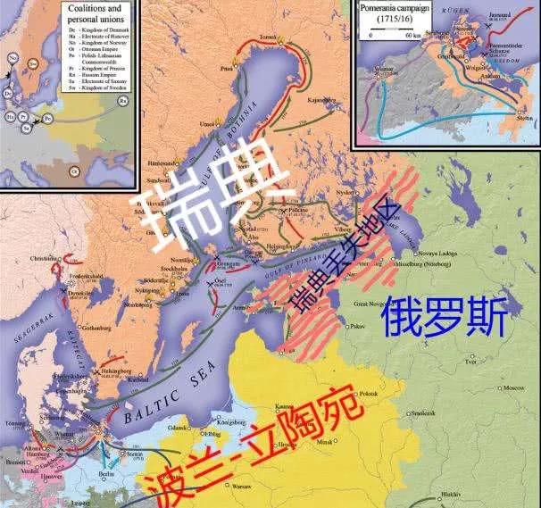
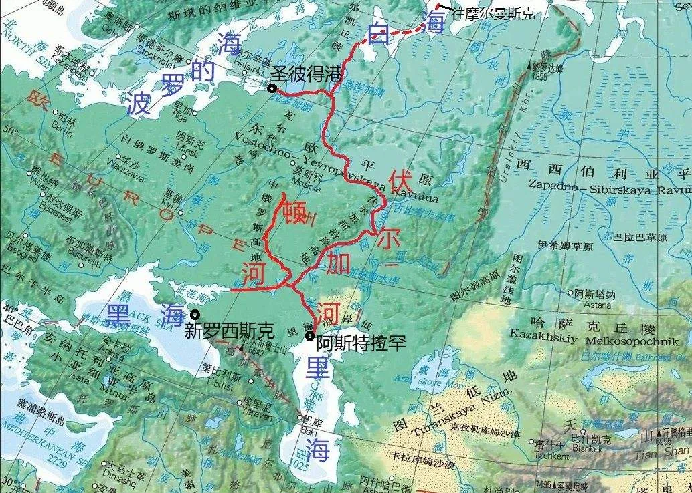
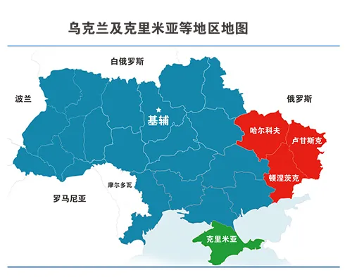
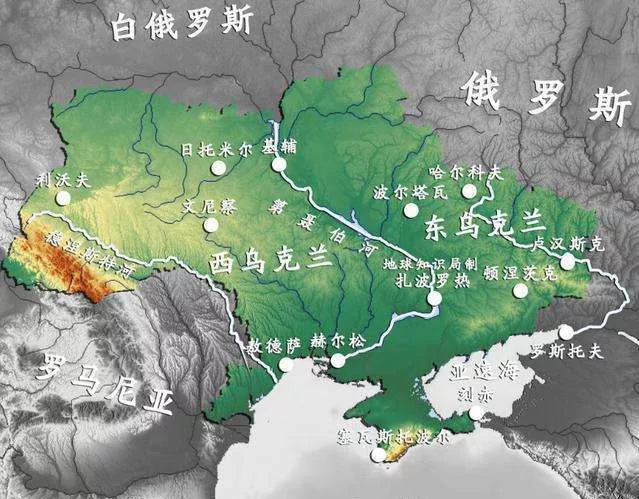

#  对当前乌克兰局势的看法

[toc]

通常而言，**大国的内政，决定其外交；小国的外交，决定其内政**。**在分析国际关系问题时，通常要从内政、外交、地缘、历史等多个视角入手**。

## 一、外交篇：为什么西方国家在乌克兰问题上寸步不让？

**这个世界上最容易被低估的民族就是俄罗斯民族**，从历史上来看，俄罗斯可以被打倒100次，但只要有一次崛起，就是亚欧大陆的噩梦。

1700年大北方战争形势图：

比如大北方战争，1700年俄罗斯还被装备精良的瑞典人打得节节败退。但俄罗斯人没有气馁，沙皇砸碎了教堂的钟拿来铸造大炮。仅隔了9年，卧薪尝胆的俄罗斯就在乌克兰东部全歼了瑞典军队主力，实现了复仇。瑞典也因此一蹶不振，消失在世界强国之林。

1814年，俄罗斯沙皇到巴黎阅兵。

再比如拿破仑战争时期，尽管战争初期俄军在拿破仑手下一败再败，数以万计的俄军被赶到水里面喂鱼，乃至于整个西欧都被拿破仑给横扫了一遍。但俄罗斯还是凭借无畏的牺牲和莫斯科的冬天击败了拿破仑，最终沙皇骑着高头大马、以反法联军总司令身份到巴黎阅兵。

1945年，苏联旗帜插到柏林国会大厦。

二战期间，德国也犯了低估苏俄的战略性错误。战争爆发前，希特勒认为苏军经过大清洗后战斗力不值一提，苏芬战争苏军的表现更是加深了他这一判断。因此德国才敢提出三个月灭亡苏联的大胆计划。诚然，苏联在战争之初表现确实糟糕，开战不到一个月就损失了300万军队，丢失了70%以上的工业基地。但苏俄再次凭借顽强的毅力和大无畏的牺牲精神，最终击败了纳粹德国，将红旗插到柏林国会大厦。

> 三个例子：
>
> 1. 瑞典对俄罗斯
> 2. 法国对俄罗斯
> 3. 德国对苏联

纵观历史，俄罗斯这个民族，**你越是轻视它，它越是容易爆发出强大的力量**。历史上大多数时期俄罗斯都是虚弱的，比如克里米亚战争时期被英法暴打，日俄战争时期输给了实力远逊于自己的日本，甚至到了上个世纪20年代，苏联还被波兰人占领了大片国土。但俄罗斯人往往都能借助战争的失败，实现自我反省与内部革命，最终反败为胜。1905年的时候俄罗斯败给了日本，1945年的时候苏联红军就已经可以摧枯拉朽地碾压日本关东军了；1921年苏联还被迫向波兰割地求和，1940年苏联就和德国联手瓜分了波兰，并在二战后成为波兰的太上皇。

如今的俄罗斯，看似已经大不如前，GDP连韩国都不如。但实则不然，俄罗斯GDP比较低主要有两个原因：**1、金融领域被西方制裁，卢布汇率大幅贬值；2、俄罗斯重工业比较发达，轻工业、服务业占比偏低，这在和平年代比较吃亏，但在战争年代，重工业才是一国实力的体现**。韩国尽管第三产业发达，但遇到战争期间，什么影视娱乐餐饮旅游业，基本不会产生多大价值。

更重要的是，俄罗斯民族内心的傲气和死磕到底的决心依然存在。历史上看，俄罗斯人是最喜欢较劲的民族，不达成目的决不罢休，也不怕死人。也正是因此才耗死了拿破仑法国、纳粹德国、奥斯曼帝国等强国。

俄罗斯人喜欢死磕的习惯，与其文化底蕴有很大关系。总的来说，**俄罗斯的文明底蕴主要由三部分构成：1、自认为是东罗马帝国的继承者；2、蒙古人的习性传承；3、伏尔加河文化**。

俄罗斯的双头鹰继承自东罗马帝国。

我们知道东罗马帝国灭亡后，罗马的衣钵被俄罗斯继承，**历任沙皇皆以光复君士坦丁堡为己任**，为此不惜发动了十二次俄土战争，从土耳其手里抢占了包括克里米亚和高加索在内的黑海沿岸地区。东罗马——东正教为俄罗斯民族带来了自信，无论俄罗斯科技和经济相比西欧有多落后，但俄罗斯在西欧面前一直都是趾高气昂的，原因就在于俄罗斯认为自己才是罗马帝国的正统继承人，西欧只不过是日耳曼和拉丁蛮族罢了。好比近代中国可以认为不如欧美，但一定不愿意认为不如日本，因为历史上中华文明长期比日本文明更先进。

俄罗斯历史上被蒙古人（金帐汗国）统治过很长时间。

俄罗斯与其他斯拉夫民族建立的国家都有历史仇恨。

几乎所有的中国人，都会将俄罗斯民族算作白种人。但**大部分西欧人，都会将俄罗斯民族看成半个蒙古人**。历史上成吉思汗后代建立的金帐汗国，在俄罗斯统治过很长时间。蒙古人与斯拉夫人大量通婚，使俄罗斯人呈现出部分蒙古人的特征，特别是蒙古人好勇斗狠的性格以及对土地的贪婪。在近代期间，俄罗斯的国土面积扩大了170倍，周边的国家，包括波兰、土耳其、瑞典、德国、中国、日本，都被俄罗斯侵占过土地，几乎跟周边民族都结下了历史仇恨。

俄罗斯的母亲河——伏尔加河：

但如果喜欢文学艺术的人，会发现俄罗斯也有很高雅的一面。**近代世界三大文学中心，分别是英国、法国、俄罗斯**，这三个国家出产了大量优秀的小说和诗歌，论文学底蕴，俄罗斯比美国、德国等后发国家要深厚。俄罗斯深厚的文化底蕴跟伏尔加河有关，作为世界上最长的内流河，伏尔加河孕育了俄罗斯40%以上的人口，由于景色过于优美，催生了大量作家和艺术家。俄罗斯人内心是非常有诗意的，很多人年轻人经常对着伏尔加河伤感。俄罗斯民族对伏尔加河寄托了太多的情感，视其为母亲河，二战期间，尽管苏联在战争之初一退再退，但德军却止步斯大林格勒。因为当大多数俄罗斯知道“背后就是伏尔加河”后，都像打了鸡血一样地与德国人死磕。能激发俄罗斯人保家卫国热情的，不是共产主义，而是对母亲河的热爱。莫斯科可以丢掉，但伏尔加河决不能失去。

另一方面，俄罗斯人在科学领域也有很高造诣，特别是数学方面。过去中国的高等数学体系，以及数学竞赛的模式，就是照搬苏联的。苏俄人将数学视为艺术，以口算为荣，把解数学题当成生活爱好。也正是凭借强大的数学功底，苏联才能成为世界上第一个发射人造地球卫星的国家。

因此俄罗斯民族实际上不仅武德充沛，文化方面也毫不逊色，或许西方可以凭借暂时的技术领先打败俄罗斯人，但过不了多久，俄罗斯人就能奋起直追，把这些技术摸索透，然后凭借庞大的体量反败为胜。如今来看，俄罗斯依然是世界级强国，其最大的板块就是经济不行，**经济不行的原因也并非俄罗斯人不擅长经商，而是因为其缺乏优良的出海口**。**一旦俄罗斯蚕食乌克兰成功，黑海北岸重归俄罗斯控制，那俄罗斯就有机会发展起现代化工商业**。

与其说西欧国家普遍讨厌俄罗斯，不如说西欧国家普遍害怕俄罗斯。欧盟的核心——德国和法国，均被俄罗斯占领过首都，沙皇骑着高头大马在巴黎阅兵/苏联红军攻克柏林的历史让德法难以忘怀。东欧的国家大多被俄罗斯侵略过，包括波兰、芬兰、立陶宛、乌克兰、罗马尼亚、匈牙利等，因此对俄罗斯也是极其痛恨。甚至中国对苏俄都心有余悸，不信可以问问上个世纪60年代在华北地区待过的人，那个时候防“苏修”的压力远甚于防“美帝”的压力。当时之所以大搞三线建设，一部分原因就是担忧苏联入侵后，如果北京快速沦陷，得找个可靠的大后方与苏联打持久战。

当前西方之所以在乌克兰问题上对俄罗斯寸步不让，一方面是因为对俄罗斯过于害怕，欧盟承平日久，一旦打起仗来，俄罗斯不怕死人，但欧盟是非常害怕出现大量伤亡的，因此欧盟不惜被美国驻军，也要坚决遏制俄罗斯的军事扩张。在经济问题上，欧盟很愿意与俄罗斯加强合作；但在乌克兰问题上，欧盟是不愿意俄罗斯吞并乌克兰的，因为那会导致欧盟柔软的腹部暴露在俄军面前。

绥靖政策的失败使西方在对俄问题上一步也不敢放松。

 另一方面，二战期间英法对德国一度采取绥靖政策，默许德国吞并奥地利和捷克斯洛伐克，结果不仅没有满足德国胃口，还使德国实力越来越强大，最终导致德国接连入侵波兰和法国，对德政策完全失败。

因此如今西方在对俄问题上一步也不敢放松，假如承认克里米亚属于俄罗斯，能确保俄罗斯下一步不继续蚕食乌克兰其他领土了吗？假如默许俄罗斯吞并乌克兰，能保证俄罗斯下一步不会吞并白俄罗斯、哈萨克斯坦，重建苏联？假如默许俄罗斯重建苏联，能确保新苏联不会大举进攻西欧，统一整个欧洲大陆？

因此在乌克兰问题上，西方绝不可能松动。更何况还有美国、英国等在背后煽风点火。事实上欧俄对立是英美最想看到的，对美国来说，欧俄对立相当于以敌攻敌之术，同时让欧盟和俄罗斯内耗；对英国来说，只有欧洲大陆动荡，英国才能获得绝对安全。而且欧洲越乱，就会有越多的资金流向英美。

## 二、内政篇：为什么拜登和普京都无路可退？

如果从内政方面来研究乌克兰问题，可以得出一些新的看法。

首先是乌克兰方面，我们知道乌克兰总统泽连斯基在上任这三年面临一堆烂摊子。首先是乌克兰经济持续衰退，失业率居高不下，很多年轻人找不到工作。原因在于乌克兰一方面与俄罗斯断绝了经济往来，失去了原材料供应地和最大市场，另一方面欧盟既不愿意对乌克兰开放市场，更不愿意吸收乌克兰成为新成员国。毕竟欧盟只想让乌克兰成为缓冲国，而非惹火上身与俄罗斯硬碰硬。因此乌克兰经济处于两头不讨好的境地。新冠疫情爆发后，乌克兰疫情也长期得不到解决，很多政府高官都感染了新冠，国内医疗条件非常糟糕。泽连斯基的支持率也一度走低。

乌克兰局势图：

更重要的是，乌克兰还面临俄罗斯的蚕食。2014年以来，俄罗斯长期对乌克兰东部反叛州提供武器和军事训练，假以时日，乌克兰东部三州迟早会独立，俄罗斯可能也会更进一步，继续蚕食乌克兰其他区域。也就是说，乌克兰面临温水煮青蛙的局面，如果再不反抗，迟早要被瓜分。

因此泽连斯基才会选择放手一搏，一方面是为了赢得国内支持率，毕竟90%以上的乌克兰人都反俄，只要对俄足够强硬，哪怕经济搞不好，泽连斯基也能坐稳总统位置。另一方面，乌克兰想以小博大，通过对乌东叛军动武，来诱使俄罗斯开第一枪。毕竟乌克兰平叛具有合法性，但如果俄罗斯为了保护乌东民间武装而对乌克兰开火，那是违反国际法的。这样一来，乌克兰就可以将自身塑造为被侵略方，以此来拖北约下水。即便北约不直接出兵，但至少也会大幅提高对乌克兰援助。当然，泽连斯基这么赌是有风险的，万一俄罗斯一不做二不休把乌克兰吞并了，那泽连斯基只能当流亡总统了。

因此可以说，乌克兰是以国家存亡为筹码，赌俄罗斯敢不敢和北约掀桌子，以此来倒逼北约出手，毕竟北约大多数国家不愿意失去乌克兰这个战略屏障。赌赢了，乌克兰可以获得北约更大援助，甚至真的打起来，乌克兰加入北约都有戏；赌输了，轻则割让土地，重则亡国。

所以不要低估乌克兰政府的博弈能力，这属于典型的以小博大，赌注虽然是乌克兰的存亡，但即便乌克兰亡国，乌克兰政府也可以流亡海外，享受高额的补贴。所以说有时候个人/党派利益和国家利益未必一致，好比上市公司管理层和股东利益也未必一致，管理层经常会做出加杠杆的事情，赢了自己涨奖金，输了大部分损失由股东承担。

对普京来说，乌克兰问题变得很棘手。因为2024年俄罗斯就要迎来大选，决定之后6年俄罗斯总统归属。当前来看，东乌地区有几百万俄罗斯人，假如普京因为害怕和北约起冲突而退缩，那其在俄罗斯的声誉将一落千丈。事实上普京这些年的政绩乏善可陈，经济一塌涂地，抗疫也比较失败，很多俄罗斯的年轻人对普京不满已久。普京引以为傲的政治优势就是对外强硬，特别是收复克里米亚的功绩。如果普京退让了，那2024年俄罗斯总统大选普京很可能会落选，普京的政治生涯提前结束。我们知道普京执政以来得罪了太多人，其家族也聚敛了大量财富，一旦普京失去权力的庇护，很容易被清算。因此普京绝不会退让，他宁可冒着与北约开战的风险也要强硬下去。对普京来说，未来的出路就是扶持一个可靠的政治继承人，然后让其提前赦免自己，让普京家族能够长期延续。

> 这个地方说“普京的家族聚敛了大量财富”先存疑，我目前还没看到确凿的证据

去年以来美国通胀居高不下。

拜登支持率节节走低。

对拜登来说，乌克兰问题同样是烫手山芋。我们知道拜登上任以来在内政方面也是一塌糊涂。抗疫是很失败的，拜登执政期间美国因为新冠死亡的人数甚至超过了特朗普执政时期。财政/基建刺激法案一直推不出，所谓的3.5万亿财政支出沦为泡影，“重建美好未来”的口号被大多数美国人视为画饼。由于货币大量超发，拜登执政期间美国通货膨胀率节节上升，创下近几十年来新高，美国民怨沸腾。另一方面，去年美国阿富汗撤军，使塔利班卷土重来，严重打击了美国的国民信心和国际形象，拜登可以说同时得罪了美国军方和国民。因此自拜登执政以来，支持率持续走低，堪称二战以来美国最不受欢迎的总统之一。

在这种背景下，如果拜登在乌克兰问题上服软，那和政治自杀差不多。民主党必然会输掉2022年中期选举，而且是众议院和参议院同时都丢掉。这样一来拜登及其内阁不仅是晚节不保的问题，甚至面临秋后算账的问题。对整个民主党来说，是绝不希望在拜登执政期间失去乌克兰的，因为这样以来就给了共和党借口，让共和党提前赢得2024年美国大选。

而且美国一旦在乌克兰问题上服软，后果远比阿富汗问题严重，那会带来严重的信任危机，美国的盟友可能对其能力和责任心会产生严重质疑，欧盟可能会加大欧洲联合军的投入，这也是美国无法接受的。

因此，尽管俄罗斯蚕食乌克兰，会使欧俄之间失去缓冲国，导致欧俄矛盾激化，从长期来看对美国有利。但至少在当下，美国在乌克兰问题上不得不强硬一些，硬着头皮也要给乌克兰提供军事援助，甚至不排除在局势恶化的时候投入武装力量，与俄罗斯打一场代理人战争。

因此对当下的乌克兰局势来说，只有两种可能：1、走向战争，俄罗斯进攻乌克兰，北约介入；2、美、俄、乌有一方选择退让服软，但这意味着个人/党派的政治失败。

对情况二来说，拜登和普京应该都不会退让，因为二者现在都面临国内信任危机，好比两个人在悬崖上对峙，任何一方退却都意味着粉身碎骨，都寄希望于对方先退让。所以理论上来说如果退让，只能是乌克兰退让，比如在美国的要求下，泽连斯基选择小打小闹，让乌军对着无人区或者天空打上几炮，既满足了国民的对外诉求，又避免俄罗斯死人以激怒俄罗斯。因此未来一段时间，乌俄边境有可能炮火连天，但可能死不了太多人。

对无人区开炮，虽然能暂时取悦国民，也避免激怒对手。但长期来看也不是个办法，毕竟乌克兰国民需要看到实实在在的利益。因此如果乌克兰军队不愿意真正动手收复失地的话，泽连斯基的民意支持率长期来看是走低的。

俄乌边境军力部署。

对情况二来说，如果乌俄真的开战，俄罗斯可能会选择快刀斩乱麻。目前俄罗斯在俄乌边境部署了十多万人的军队，配备了上千辆坦克。但这些可能只是诱敌部队，俄罗斯真正的战略重点可能是配置在白俄罗斯境内的5个军，以及从哈萨克斯坦结束任务、刚归国的空降伞兵部队。

俄罗斯可能会对基辅实行斩首战术：

从哈萨克斯坦的经验来看，俄罗斯的空降部队可以胜任突袭任务。一旦乌军在东部地区发动攻势，俄罗斯可以声东击西，从白俄罗斯境内向基辅发动袭击。先借助空军和S-400防空系统扫清乌克兰空中力量，在掌控了制空权后。俄军空降部队率先抵达基辅，占领基辅各大机场，并控制其发电站、通信系统、火车站等重要设施。与此同时俄罗斯驻扎在白俄罗斯的5个军可以南下直插基辅，这一过程可能几天就能完成。

当然俄罗斯如果胃口足够大，也可以直接进攻乌克兰西部，将乌军与北约军队分隔开来。如果北约想参战，就必然要主动攻击俄罗斯，之后俄罗斯再逐步占领乌克兰剩余地区。这一方案的风险在于会彻底激化俄罗斯与北约的矛盾，但如果俄罗斯已经决心和西方撕破脸，那这么干也不是不可能。

对我国来说，应该提前有所应对。一旦乌俄开战，无论战争结果如何，欧盟和俄罗斯都会因为缓冲国的丧失而走向敌对，欧美可能会联手开启新冷战，未来全球政治经济的不确定性明显上升。